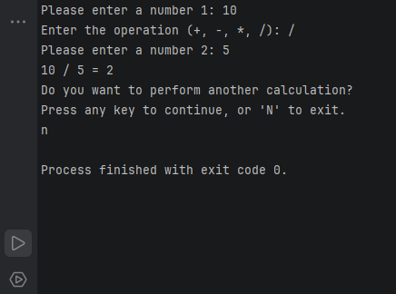

# Calculator

A simple console-based calculator built with C#.

## Features

- Addition
- Subtraction
- Multiplication
- Division
- Numeric input validation
- Operation validation
- Division-by-zero handling
- Perform multiple calculations in one run

## Technologies

- C#
- .NET 10

## How to Run

1. Clone the repository.
2. Open the solution in JetBrains Rider or Visual Studio.
3. Run the application.

## Usage

The calculator asks the user to:

1. Enter the first number.
2. Choose an operation (`+`, `-`, `*`, `/`).
3. Enter the second number.
4. View the calculation result.
5. Choose whether to perform another calculation.

Invalid numeric input and invalid operations are handled by the application.
## Screenshot
